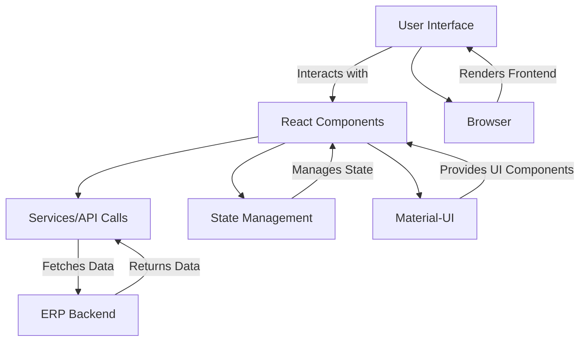

# ERP_frontend

The ERP Frontend is a React-based user interface for an Enterprise Resource Planning (ERP) system. It provides a modular and responsive interface for managing users, jobs, and other business operations. This project is designed to work seamlessly with the ERP backend.

---

## Features

- **User Management**: Add, edit, and delete users with role-based access.
- **Job Management**: Create, filter, and manage jobs with advanced filtering options.
- **Dynamic Field Options**: Fetch and display dynamic field options for categories and billing statuses.
- **Responsive Design**: Optimized for desktop and mobile devices.
- **Role-Based Access**: Different views and actions based on user roles.
- **Error Handling**: User-friendly error messages and notifications.

---

## Technologies Used

- **React**: For building the user interface.
- **TypeScript**: For type safety and better developer experience.
- **Material-UI**: For responsive and modern UI components.
- **Axios**: For API requests.
- **Sonner**: For toast notifications.
- **React Router**: For navigation and routing.
- **State Management**: Managed using React's

---

## Prerequisites

- **Node.js**: Version 16 or higher.
- **npm**: Version 7 or higher.
- **ERP Backend**: Ensure the backend is running and accessible.

---

## Installation

#### 1.Clone the Repository:

```bash
cd ERP_frontend
```

#### 2.Install Dependencies:

```bash
npm install
```

#### 3.Configure Environment Variables: Create a .env file in the root directory and add the following:

```bash
REACT_APP_API_BASE_URL=http://localhost:8080
```

#### 4.Start the Development Server:

```bash
npm run dev
```

### Frontend Architecture Diagram



## Contributors

- **[Bharath R Sindhe](https://github.com/bharathsindhe03)**
- **[Abhiram H R](https://github.com/Abhiramhr1)**
